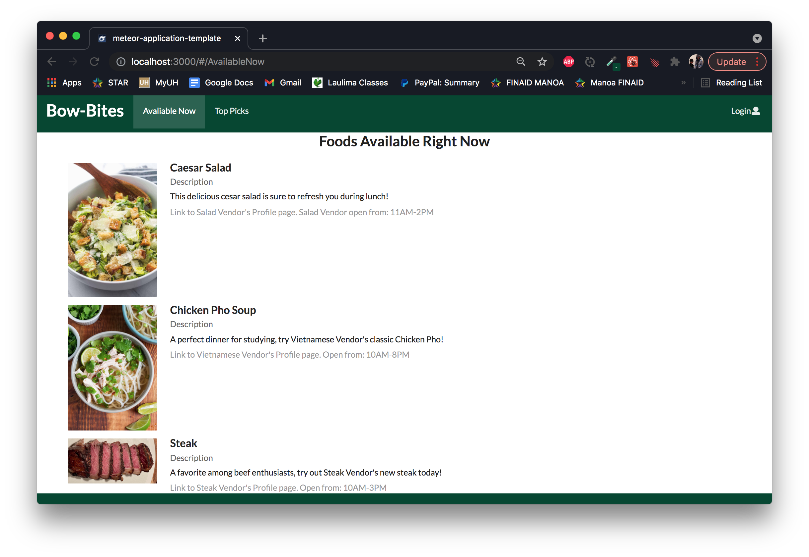
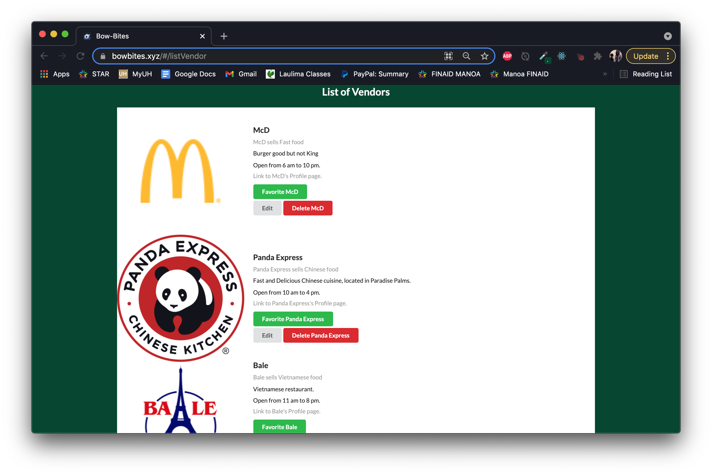
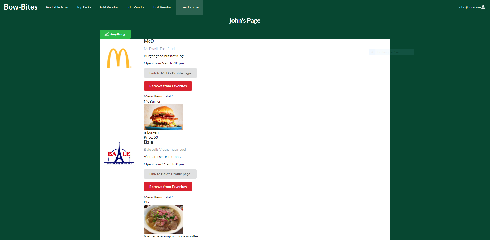
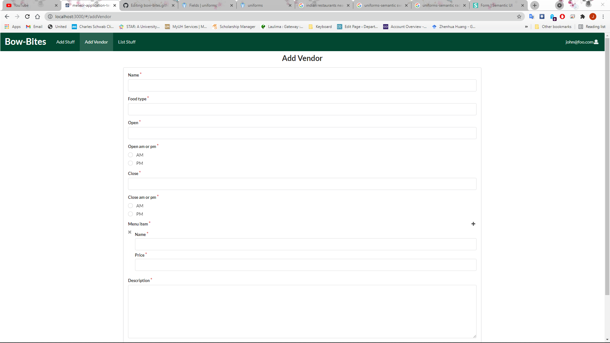

## Table of contents

* [Overview](#overview)
* [User Guide](#user-guide)
* [Developer Guide](#developer-guide)
* [Organization and Members](#organization-and-members)
* [Project Milestones](#project-milestones)


## Overview

The goal of ‘Bow Bites is to allow students to quickly and easily find a place to eat, including finding places that offer a specific type of food, places in certain locations, places that are currently open, and to be able to see the menus for the current day / week.

The system providea three roles: Users, who can log in establish and sort by their food preferences; Vendors, who can log in to modify their profiles and set their menus; and Admins, who can log in to add and delete vendors, and administrate the system. 

The directory of food items will be from UHM food vendors and Manoa Dining Services. It will be easy to use and allow food items to be sorted by their type (ethnicity, vegan/not vegan, etc...).

Users will be able to see a page where food is recommended to them. Users can establish their preferences and exclude food they dislike. 

Different campus locations will also have pages with profiles of vendors and their choice of the day. Vendors can log in and set their menu for the week.


## User Guide

This section provides a walkthrough of the bow-bites user interface and its capabilities.


### Landing Page

The landing page is presented to users when they visit the top-level URL to the site.


### Available Now Page

The Available Now Page shows what vendors they are open at that time.




### Vendor List Page

A list of vendors, what food they sell, opening/closing times, and descriptions. There are options to favorite a vendor if logged in as a user.




### User Profile Page

Shows vendors that the user has favorited, and filter those favorited vendors. 




### Edit Vendor Page 

If a user owns a vendor they can go to this page to set the vendor's menu and profile. 


### Add Vendor Page 

The screen that the admin can access to add new vendors.



### Admin Page 

Displays a list of all vendors, and allows the admin to delete or edit any vendor. 


## Deployment 

Here is a picture of bow-bites deployed on digital ocean.


Here is a link to our digital ocean droplet: 
[https://bowbites.xyz/#/](https://bowbites.xyz/#/)


## Community Feedback

#### Abdullah
- Change text of Anything button to Pick for me button. (Implemented) 
- Likes how you can have favorites and filter in User Profile.
- Navbar shouldn't have "Edit my Vendors" tab if user does not own vendors.   

#### Sarah 
- On mobile if you click the "Pick for me" button and scroll, it will scroll through all the menu items.
- Edit the landing page to be more clearly readable. (Implemented) 
- Fix error in menu item data for The Bean Counter. (Implemented) 

#### Josh 
- Lack of email validation.
- Would like a a way to see the how far the user is from the vendor.
- Likes how everything is 1 or 2 clicks away from the homepage. 

#### Christian 
- Switch the position of the $ sign on the prices, since it usually comes before the price on a menu (Implemented)
- Color the price in so that it stands out a bit more, since most people will be interested in the price right away

#### Diane 
- Some of the vendorImages are a bit fuzzy when they show full size in the vendorProfile, so maybe link some higher res ones (Implemented)
- Add a little bit of extra spacing to the menu items and their descriptions, so that it flows a bit better and looks less cramped (Implemented)


## Developer Guide 

First, install meteor.

Second, download a copy of bow-bites. 

Third, cd into the app directory install the required libraries with:

```console
$ meteor npm install
```

Once the libraries are installed, you can run the application by invoking:

```console 
$ meteor npm run start
```

The first time you run the app, it will create some default vendors, users, and favorites. Here is the output:

```console
meteor npm run start

> meteor-application-template-react@ start /Users/coleamparo/GitHub/ColeAmparo/bow-bites/app
> meteor --no-release-check --exclude-archs web.browser.legacy,web.cordova --settings ../config/settings.development.json

[[[[[ ~/GitHub/ColeAmparo/bow-bites/app ]]]]] 

=> Started proxy.                             
=> Started MongoDB.                           
I20211130-12:30:20.607(-10)? Creating the default user(s)
I20211130-12:30:20.610(-10)?   Creating user admin@foo.com.
I20211130-12:30:20.882(-10)?   Creating user john@foo.com.
I20211130-12:30:21.061(-10)? Creating default Vendors.
I20211130-12:30:21.063(-10)?   Adding: McD (john@foo.com)
I20211130-12:30:21.159(-10)? Creating default Favorites.
I20211130-12:30:21.161(-10)?   Adding: john@foo.com ([object Object])
I20211130-12:30:21.434(-10)? Monti APM: completed instrumenting the app
=> Started your app.

=> App running at: http://localhost:3000/

```

If all goes well, the template application will appear at http://localhost:3000. You can login using the credentials in settings.development.json, or else register a new account.

Lastly, you can run ESLint over the code in the imports/ directory with:

```console
meteor npm run lint
```


## Organization and Members

Henry Blazier: I am currently pursuing a degree in computer science at the University of Hawaii and am expected to graduate in 2022. I have an intrest in systems automation.
[https://hbzxc.github.io/](https://hbzxc.github.io/)

Alexander Jones: I'm studying for a B.S in Computer Science in the Department of Information and Computer Sciences at the University of Hawaii. I expect to graduate in 2022 or 2023. [https://acjones8.github.io](https://acjones8.github.io/)

Cole Amparo: I am studying for a B.A. in Computer Science in the Department of Information and Computer Sciences at the University of Hawaii. I expect to graduate in Spring, 2023. 
[https://coleamparo.github.io/](https://coleamparo.github.io/)

[The bow-bites organization](https://github.com/bow-bites)


## Project Milestones
For Milestone 1, our progress was coordinated using the [M1](https://github.com/bow-bites/bow-bites/projects/1) project board.

For Milestone 2, our progress was coordinated using the [M2](https://github.com/bow-bites/bow-bites/projects/2) project board.

For Milestone 3, we're currently using the [M3](https://github.com/bow-bites/bow-bites/projects/3) project board.
