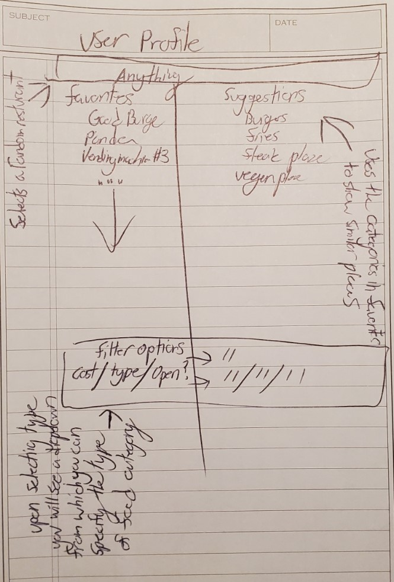

## Table of contents

* [Goals](#goals)
* [System Approach](#system-approach)
* [Mockup Pages](#mockup-pages)

## Members

Henry Blazier: I am currently pursuing a degree in computer science at the University of Hawaii and am expected to graduate in 2022. I have an intrest in systems automation.
[https://hbzxc.github.io/](https://hbzxc.github.io/)

Alexander Jones: I'm studying for a B.S in Computer Science in the Department of Information and Computer Sciences at the University of Hawaii. I expect to graduate in 2022 or 2023. [https://acjones8.github.io](https://acjones8.github.io/)

Cole Amparo: I am studying for a B.A. in Computer Science in the Department of Information and Computer Sciences at the University of Hawaii. I expect to graduate in Spring, 2023. 
[https://coleamparo.github.io/](https://coleamparo.github.io/)

## Goals

The goal of ‘Bow Bites is to allow students to quickly and easily find a place to eat, including finding places that offer a specific type of food, places in certain locations, places that are currently open, and to be able to see the menus for the current day / week.

## Repository

[The bow-bites code repository](https://github.com/bow-bites/bow-bites)

## Deployment
[Bow-Bites](http://143.198.158.134/#/)

## System Approach

The system will eventually provide three roles: Users, who can log in establish and sort by their food preferences; Vendors, who can log in to set their choice of the day, and modify their profiles; and Admins, who can log in to set users as vendors, and administrate the system. 

The directory of food items will be from UHM food vendors and Manoa Dining Services. It will be easy to use and allow food items to be sorted by their type (ethnicity, vegan/not vegan, etc...).

Users will be able to see a page where food is recommended to them. Users can establish their preferences and exclude food they dislike. 

Different campus locations will also have pages with profiles of vendors and their choice of the day. Vendors can log in and set their menu for the week.

## Mockup Pages

These are some examples of possible pages.

### Landing Page

The landing page is presented to users when they visit the top-level URL to the site.

### Available Now Page

The Available Now Page shows users what food they are able to get at that time.

### Top Picks Page

The Top Picks Page shows users the day's top food picks. 

### Add Vendor Page 

The screen new vendors will be shown upon attempting to set up a new shop

### User Profile

What a user will see on their profile

## Deployment 

Here is a picture of bow-bites deployed on digital ocean.

Here is a link to our digital ocean droplet: 
[http://143.198.158.134/#/](http://143.198.158.134/#/)

